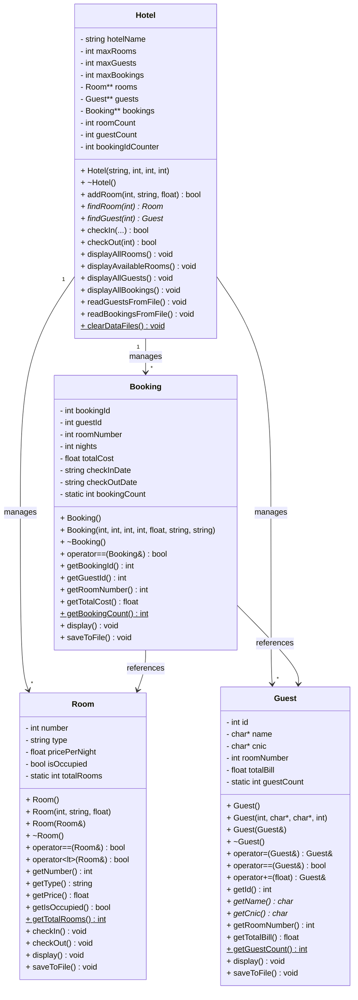
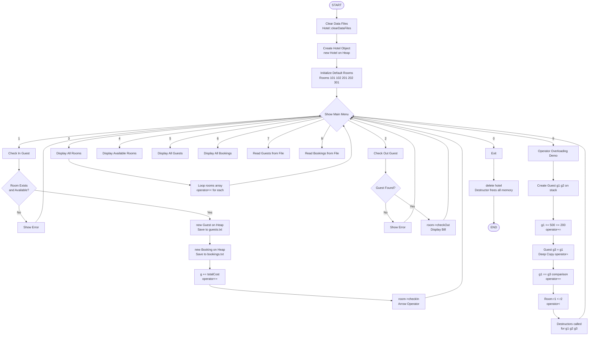

# 🏨 Hotel Management System — C++ OOP Project

A beginner-friendly Hotel Management System in C++ that covers **all OOP concepts** from Week 1 to Week 6, including Pointers, Dynamic Memory, Operator Overloading, File Handling, and more.

---

## 👨‍💻 Author

| Field | Details |
|-------|---------|
| **Name** | Muhammad Muaaz Ali |
| **Roll Number** | 2025-CS-708 |
| **Language** | C++ |
| **Project** | OOP — Hotel Management System |

---

## 📚 Topics Covered (Week-by-Week)

| Week | CLO | Topics Demonstrated in Code |
|------|-----|------------------------------|
| **Week 1** | CLO1 | Classes vs Structs, Encapsulation, Abstraction, Protection, Access Modifiers (`public`, `private`), Implicit member functions |
| **Week 2** | CLO2 | Programmer-defined Constructor, Copy Constructor (Deep Copy), Destructor, Assignment Operator (`=`), Shallow vs Deep objects |
| **Week 3** | CLO2 | Separate declaration & definition, Accessors, Utility methods, Objects as arguments & return types, Cascaded function calls |
| **Week 4** | CLO2/CLO3 | `static` members, `const` members, Object members, Constructor initializer list, `this` pointer |
| **Week 5** | CLO3 | Arrow `->` operator, `new` / `delete` for dynamic objects, Array of pointers, Heap allocation |
| **Week 6** | CLO3 | Operator Overloading (`==`, `<`, `+=`, `=`, `<<`), Member & Friend operators, Cascaded operator calls |

---

## 🗂️ File Structure

```
hotel-management/
│
├── main.cpp          ← All code in one file
├── guests.txt        ← Auto-generated: guest records
├── rooms.txt         ← Auto-generated: room records
├── bookings.txt      ← Auto-generated: booking records
└── README.md         ← This file
```

---

## 🧱 Class Overview

| Class | Responsibility |
|-------|----------------|
| `Guest` | Stores guest info, uses dynamic `char*`, operator overloading |
| `Room` | Represents hotel room, tracks availability, static room count |
| `Booking` | Links guest to room, stores cost & dates, static booking count |
| `Hotel` | Main controller, manages dynamic arrays of pointers, file I/O |

---

## 📊 UML Class Diagram



---

## 🔄 Program Flowchart



---

## ⚙️ How to Compile & Run

### Linux / Mac
```bash
g++ -o hotel main.cpp
./hotel
```

### Windows (MinGW)
```bash
g++ -o hotel.exe main.cpp
hotel.exe
```

### Windows (Dev-C++ / Code::Blocks)
- Create a new project
- Add `main.cpp`
- Click **Build & Run**

---

## 🧪 Sample Run

```
------------------------------------------------------------
   *** HOTEL MANAGEMENT SYSTEM ***
------------------------------------------------------------
  1. Check In Guest
  2. Check Out Guest
  3. View All Rooms
  4. View Available Rooms
  5. View All Guests
  6. View All Bookings
  7. View Guest Records (from File)
  8. View Booking Records (from File)
  9. Demonstrate Operator Overloading (Week 6)
  0. Exit
------------------------------------------------------------
  Enter your choice: 1
```

---

## 💡 Key OOP Concepts at a Glance

### 🔐 Encapsulation
All data members are `private`. They can only be accessed through `public` methods (accessors/mutators).

### 🧩 Abstraction
Users interact with `Hotel` class methods without knowing internal implementation.

### 🛡️ Protection
`private` keyword prevents direct access. Only class methods can modify state.

### 📨 Messaging
Objects communicate by calling each other's methods (e.g., `room->checkIn()`, `guest->saveToFile()`).

### 🔁 Operator Overloading (Week 6)
| Operator | Class | Purpose |
|----------|-------|---------|
| `+=`     | Guest | Add to bill |
| `==`     | Guest, Room, Booking | Equality check |
| `<`      | Room  | Compare prices |
| `=`      | Guest | Deep copy assignment |
| `<<`     | Guest, Room, Booking | Print to stream (friend) |

### 🧠 Dynamic Memory (Week 5)
- `Hotel` uses `new Room*[]`, `new Guest*[]`, `new Booking*[]`
- Individual objects created with `new Guest(...)`, `new Room(...)`
- All freed with `delete` in `~Hotel()`
- Arrow operator `->` used to access members through pointers

---

## 📁 Text File Handling

| File | Contents |
|------|----------|
| `guests.txt` | id, name, cnic, roomNumber, totalBill |
| `rooms.txt` | number, type, pricePerNight, isOccupied |
| `bookings.txt` | bookingId, guestId, roomNumber, nights, totalCost, checkIn, checkOut |

Files are written with `ofstream` (append mode) and read with `ifstream`.

---

## 👨‍💻 Author
**Name:** Muhammad Muaaz Ali  
**Roll Number:** 2025-CS-708  
**Project:** OOP — Hotel Management System  
Covers all CLO1, CLO2, CLO3 topics from Week 1–6  
Language: **C++** | File: `main.cpp` (single file)